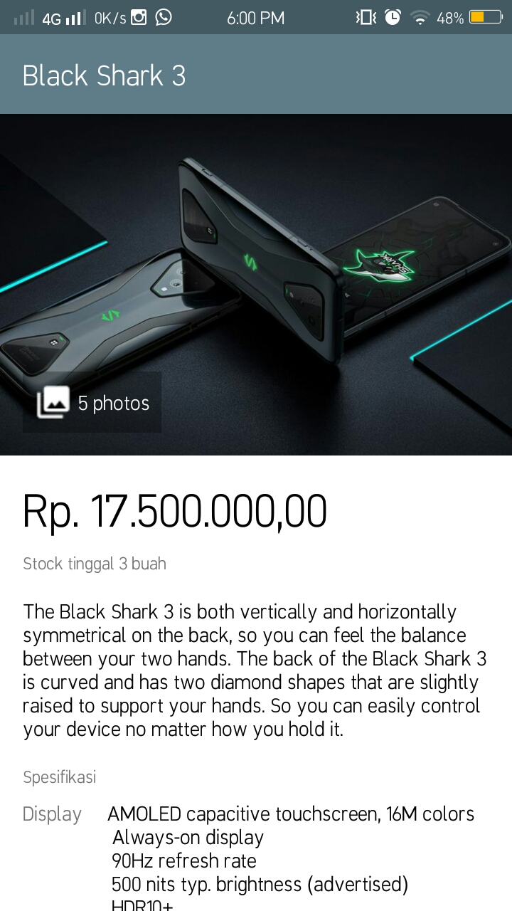

# StyleAndTheme
## Style 
>Style merupakan sebuah kumpulan properti yang dibutuhkan untuk mendefinisikan bagaimana sebuah komponen view dan layar jendela (bisa activity maupun fragment) ditampilkan. Contoh properti ini adalah height, width, background_color.
- [x] Jika CSS(Cascading Style Sheet) pada website berfungsi untuk mengatur tampilan pada website, sama Style pada Android Studio yang juga berfungsi untuk mengatur tampilan pada aplikasi android.
- [x] Jika pada [repository sebelumnya](https://github.com/rensimeila04/Views-and-Views-Group) kita mengatur tampilan manual pada activitymain.xml, pada StyleAndTheme kita mengatur tampilan pada styles.xml
- [x] Styles lebih efisien digunakan dan dapat mempermudah kita untuk menentukan tampilan.
- [x] styles.xml terletak pada res →  values  →  styles.xml.
## Tampilan 
> Berikut merupakan tampilan dari run aplikasi yang dibangun menggunakan sistem StyleAndTheme

## Atas
> Tampilan bagian atas pada aplikasi

## Bawah
> Tampilan bagian bawah pada aplikasi

## Keseluruhan
> Tampilan keseluruhan pada aplikasi

# Gracias
# Arigato Gozaimashita 
# Gamsa-hamnida 
# Thank ye 
# Xie-xie 
# Thank You 
# Maturnuwun 
# Terimakasih 🥰🥰
